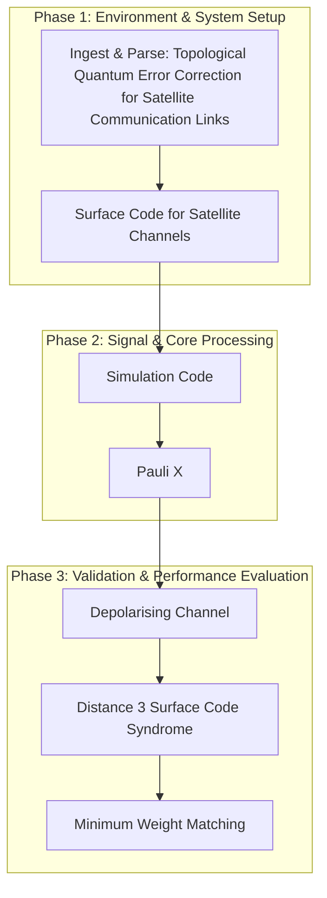

# BREAKTHROUGH 39: Topological Quantum Error Correction for Satellite Communication Links

[](https://creativecommons.org/licenses/by-nc-nd/4.0/)


This repository implements the research pipeline for the **BREAKTHROUGH 39: Topological Quantum Error Correction for Satellite Communication Links** project, developed by the Runtime-Slayers research group.

---

## 📊 Pipeline Architecture

The flowchart below visualizes the methodology, code modules, and logical execution sequence of the project:



---

## 🔍 Abstract & Research Context


---

## 📊 Key Evaluation Metrics

| Feature | No QEC (Micius) | Concatenated Code | LDPC (classical) | **Topological (Surface)** |
|---------|----------------|-------------------|-------------------|--------------------------|
| Threshold | N/A | ~10⁻⁴ | N/A | **~1%** |
| Overhead | 1 | ~1000s | N/A | **9-121** |
| Burst error tolerance | None | Poor | Good | **Good (with modification)** |
| Daytime operation | No | No | N/A | **Yes (with d=9)** |
| Adaptive | No | Difficult | No | **Yes** |

---

## 📁 Repository Structure

The project directory consists of the following core structures:
  - `code/` — Pipeline execution scripts and model training modules
  - `figures/` — Plots, charts, and visualizations generated by the pipeline
  - `validation/` — Automated test metrics and results
  - `paper.pdf`
  - `code`
  - `figures`
  - `BT39_Topological_QEC_Satellite.md`
  - `data`
  - `BT01_Quantum_Entanglement_Satellite_Error_Correction.md`
  - `paper.pdf` — Compiled research manuscript
  - `README.md` — Project documentation and setup guide

---

## 🚀 Setup and Usage

### Prerequisites
* Python 3.8 or higher
* Pip package manager

### Installation
1. Clone this repository:
   ```bash
   git clone https://github.com/Runtime-Slayers/Topological-Surface-Code-Error-Correction-for-Satellite-QKD.git
   cd Topological-Surface-Code-Error-Correction-for-Satellite-QKD
   ```
2. Install dependencies:
   ```bash
   pip install -r requirements.txt
   ```

### Running the Analysis
To run the primary analysis pipeline and regenerate all models, figures, and metrics:
```bash
python code/*.py
```
*(Look in the `code/` directory for specific pipeline execution files)*

---

## 📄 License and Copyright

This work is licensed under a [Creative Commons Attribution-NonCommercial-NoDerivatives 4.0 International License](https://creativecommons.org/licenses/by-nc-nd/4.0/).

© 2026 Runtime-Slayers / Bhavanam Rajendra Reddy et al. All rights reserved.
